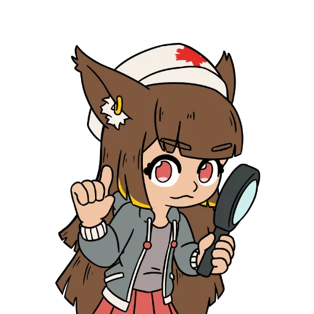

<h3 align="center">FurTDS-Macro</h3>

  

  A closed-source macro version that is completely free, featuring all essential and advanced functionalities to meet even the most demanding needs and strategies.
    
  <a href="https://github.com/K-M19/FurTDS/issues">Report Bug &amp; Help [Closed]</a>

> [!CAUTION]
> This version of FurTDS is outdated and may not be compatible with the game. FurTDS V2 is now available. While it is still in development, you can access Version 2 through invited Beta user packages, or if you are still a member of the Beta Testing server.

> [!WARNING]
> FurTDS will temporarily stop receiving updates for the next few months. There will be no upgrades or bug fixes starting from version 931. Updates will resume again in a few months.

## Highlight!
* [What is FurTDS-Macro?](#what-is-furtds-macro)
* [Requirements](#requirements)
* [FAQ](#faq)
* [Quick Loader](https://github.com/K-M19/FurTDS/tree/main/Some_Sty)
* [Docs](https://github.com/K-M19/FurTDS/tree/main/Docs)
* [Loader](https://github.com/K-M19/FurTDS/tree/main/CODE)

## Requirements!
Low Support: Some errors may occur during operation, and certain features may not work with [REC](https://github.com/K-M19/FurTDS/tree/main/Docs#rec).
* Madium **[Full Support]**
* Wave **[Full Support]**
* potassium **[Full Support]**
* Volt **[Full Support]**
* Velocity **[Full Support]**
* Delta **[Low Support]**
* Xeno **[Low Support]**
* Solara **[Low Support]**

## What is FurTDS-Macro?
* FurTDS-Macro is a project that continues the development of previous macro systems and is aimed at users who prefer automation and convenience, as well as services related to the game.
* The macro is designed to automatically replay recordings that users have previously created. It reproduces actions exactly as they were performed during the recording process, ensuring a highly accurate, consistent, and reliable playback experience.

## FAQ
* Why is FurTDS closed-source?
	* Because I want to keep it as my own project. It also helps limit the ability of other developers to study its internal workings and develop countermeasures against its operation.

* Is there a Premium version?
	* No. Everything is completely free — there are no paid features, subscriptions, paywalls, or key systems.

* Can I get banned for using it?
	* There is always some level of risk when using any macro or automation tool. However, the risk can be reduced by avoiding excessive use and by staying within reasonable limits.

* Do you have a Discord server or forum?
	* No. I do not have a Discord server, forum, or any other community platform. This is the only official place where you can get.

* What game is this macro for?
    * Uhm... [TDS](https://www.roblox.com/games/3260590327), of course. Why would you even ask that? :D